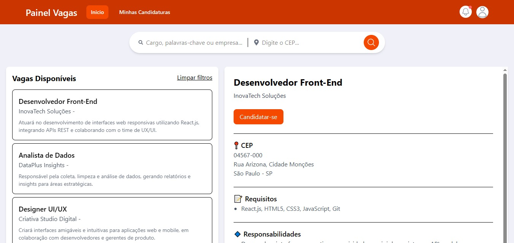

# Site de Candidatura 
  <br> 
## 📍Objetivo
> - Criação de um Site com o objetivo de empregabilidade (Candidato/Empresa). 
## 🔌Clone e Utilização
1. **Clonagem de Repositório**  
```git clone https://github.com/PauloHenrrq/ChatBot.git```

2. **Entre no diretório | Execute-o**  
```cd ChatBot```

3. **Instale as dependências**  
```npm install```

4. **Execute o Projeto**  
```npm run dev```

## 📡Tecnologias utilizadas  
### Front-End:  
- React  
- TailwindCSS  
- Formik  
- Axios  
- YUP  
### Back-End:
- NodeJS
- Sequelize
- Express
- Nodemon
- MySQL
- JsonWebToken
- cors
- bcrypt
- multer
